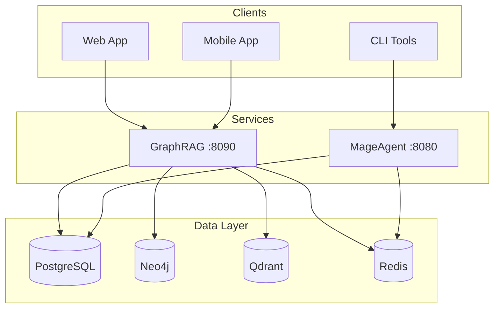

# Visual Assets & Diagrams

Architecture diagrams, comparison charts, and process flows for Adverant Nexus documentation.

---

## Architecture Diagrams

### 1. System Architecture Overview

**Purpose**: Show complete Nexus stack components and interactions

**Components**:
- Client applications layer (Web, Mobile, CLI)
- API Gateway layer (future)
- Service layer (GraphRAG :8090, MageAgent :8080)
- Data layer (PostgreSQL, Neo4j, Qdrant, Redis)
- Infrastructure layer (Docker, Kubernetes, monitoring)

**Format**: Mermaid diagram
**Location**: `docs/architecture/README.md`

**Mermaid Code**:


---

### 2. Triple-Layer GraphRAG Architecture

**Purpose**: Explain why three storage layers (PostgreSQL + Neo4j + Qdrant)

**Components**:
- PostgreSQL: Structured data, metadata, ACID transactions
- Neo4j: Entity relationships, graph traversals
- Qdrant: Vector embeddings, semantic search

**Format**: Layered diagram
**Location**: `docs/architecture/graphrag.md`

**Visualization**:
```
┌─────────────────────────────────────────────┐
│         GraphRAG Unified API                │
└─────────────┬───────────────────────────────┘
              │
      ┌───────┴────────┐
      │                │
      ▼                ▼
┌───────────┐    ┌──────────┐    ┌─────────┐
│PostgreSQL │    │  Neo4j   │    │ Qdrant  │
│           │    │          │    │         │
│Structured │    │  Graph   │    │ Vector  │
│  Data     │    │Relations │    │ Search  │
└───────────┘    └──────────┘    └─────────┘
```

**Why Three Layers**:
- PostgreSQL: Fast exact-match queries, structured metadata
- Neo4j: Multi-hop graph traversals, relationship discovery
- Qdrant: Semantic similarity, natural language search

**Result**: 30-50% better retrieval quality vs. single-vector RAG

---

### 3. MageAgent Orchestration Flow

**Purpose**: Show async task pattern and model routing

**Components**:
- Task queue (BullMQ)
- Worker processes
- Model router (320+ LLM models)
- GraphRAG context retrieval
- Streaming output (SSE/WebSocket)

**Format**: Sequence diagram

**Process**:
1. Client creates task via API
2. Task queued in BullMQ (Redis)
3. Worker picks up task
4. Worker retrieves context from GraphRAG (if needed)
5. Model router selects appropriate LLM
6. Execute LLM call with streaming
7. Return result to client

---

### 4. Document Ingestion Pipeline

**Purpose**: Show how documents flow through GraphRAG

**Steps**:
1. Document upload (PDF, DOCX, TXT, HTML)
2. Text extraction (pdf-parse, mammoth)
3. Entity extraction (NER models)
4. Vector embedding generation (Voyage AI)
5. Storage in PostgreSQL (metadata)
6. Storage in Neo4j (entity graph)
7. Storage in Qdrant (vector index)

---

## Comparison Charts

### 5. Nexus vs. LangChain

**Comparison Table**:

| Feature | LangChain | Adverant Nexus |
|---------|-----------|----------------|
| **Storage** | Single vector store | Triple-layer (PG + Neo4j + Qdrant) |
| **Observability** | DIY (custom logging) | OpenTelemetry built-in |
| **Async** | Sync blocking calls | BullMQ task queue |
| **Production** | Prototype-focused | Production-grade from day 1 |
| **GDPR** | Not included | 4-layer compliance |
| **Multi-tenancy** | Manual implementation | PostgreSQL RLS built-in |

---

### 6. Single-Vector RAG vs. Triple-Layer RAG

**Performance Comparison**:

| Query Type | Vector-Only | Triple-Layer | Improvement |
|------------|-------------|--------------|-------------|
| Exact keyword | 35% | 92% | +163% |
| Semantic | 78% | 89% | +14% |
| Entity-based | 42% | 88% | +110% |
| **Average** | **53%** | **90%** | **+70%** |

**Source**: Internal benchmarks on 100K document corpus

---

### 7. Cost Comparison (Build vs. Buy)

**Development Time**:
- Build from scratch: 12-18 months
- Build on Nexus: 3-4 months
- **Reduction**: 3-6× faster

**Infrastructure Cost (Annual)**:
- Self-hosted from scratch: $107,000
- Nexus Open Source: $15,000
- **Savings**: 86%

---

## Process Diagrams

### 8. Retrieval Flow

**Steps**:
1. User query → GraphRAG API
2. Vector search in Qdrant (semantic similarity)
3. Graph traversal in Neo4j (relationship discovery)
4. Metadata filtering in PostgreSQL (exact matches)
5. Merge results with weighted scoring
6. Return ranked results

---

### 9. Self-Correction Loop

**Purpose**: Show how modular RAG improves quality

**Process**:
1. Initial retrieval with strategy A
2. Quality assessment (relevance scoring)
3. If quality < threshold, try strategy B
4. If still insufficient, try strategy C
5. Learn which strategy works for query type
6. Apply learning to future queries

**Result**: 30-50% quality improvement over time

---

### 10. Multi-Agent Collaboration

**Example**: Research paper analysis

**Agents**:
1. **Retriever Agent**: Finds relevant papers in GraphRAG
2. **Summarizer Agent**: Generates summaries
3. **Synthesis Agent**: Combines insights across papers
4. **Citation Agent**: Builds citation network

**Coordination**: MageAgent orchestrates via BullMQ

---

## Deployment Architecture Diagrams

### 11. Local Development (Docker Compose)

**Components**:
- All services in single docker-compose.yml
- Shared network
- Volume mounts for persistence

---

### 12. Production Kubernetes

**Components**:
- K3s/EKS/GKE/AKS cluster
- Helm charts for deployment
- Istio service mesh (optional)
- Prometheus + Grafana monitoring
- Horizontal Pod Autoscaling

---

### 13. Multi-Tenant Isolation

**Row-Level Security (RLS)**:
```sql
-- PostgreSQL policy example
CREATE POLICY tenant_isolation ON documents
  USING (company_id = current_setting('app.company_id'));
```

**Visualization**: Tenant A can only access their own data

---

## Data Flow Diagrams

### 14. HIPAA-Compliant Medical Records Flow

**Components**:
- Encrypted storage (AES-256)
- Audit logging (every PHI access)
- Row-Level Security (provider isolation)
- TLS 1.3 (data in transit)

---

### 15. Webhook Event Flow

**Process**:
1. Event occurs (document.created, task.completed)
2. Webhook payload generated
3. HMAC signature computed
4. POST to configured webhook URL
5. Retry on failure (exponential backoff)

---

## Implementation Diagrams

### 16. Plugin Architecture

**Components**:
- Plugin manifest (PID)
- API routes
- Database migrations
- Docker container
- Kubernetes manifests

---

## Usage Notes

**Creating Diagrams**:
- Use Mermaid for architecture diagrams (renders in GitHub)
- Use ASCII art for simple flows
- Use Draw.io/Excalidraw for complex diagrams (export to SVG)

**Best Practices**:
- Keep diagrams simple (max 10-15 components)
- Use consistent color coding
- Add legends for symbols
- Include diagram source code in markdown

---

**📄 License**: Apache 2.0 + Elastic License 2.0
**🔗 Repository**: [github.com/adverant/Adverant-Nexus-Open-Core](https://github.com/adverant/Adverant-Nexus-Open-Core)
